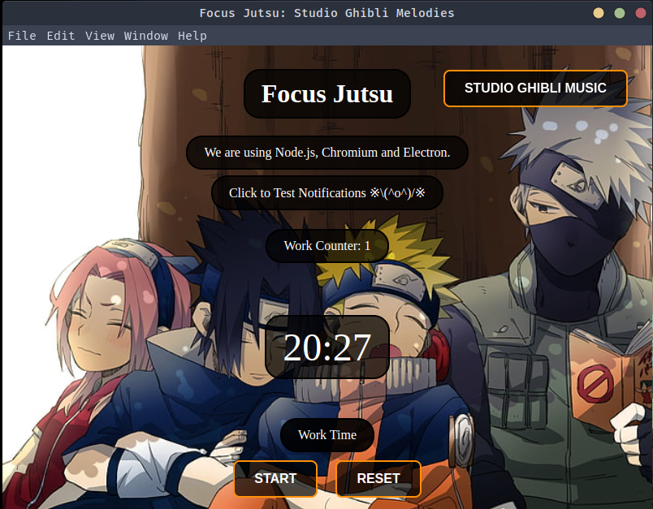

# Focused-Jutsu-Desktop-App
**Cross Platform Naruto Themed Pomodoro Timer with Studio Ghibli Music**

**Full Support for Linux Windows MacOs**

Do check out the releases section, for your respective installer. Have fun!

</img>

## Local Setup

To clone and run this repository you'll need [Git](https://git-scm.com) and [Node.js](https://nodejs.org/en/download/) (which comes with [npm](http://npmjs.com)) installed on your computer. From your command line:

```bash
# Clone this repository
git clone https://github.com/ABHIGYAN-MOHANTA/Focus-Jutsu-Desktop-App
# Go into the repository
cd Focus-Jutsu-Desktop-App
# Install dependencies
npm install
# Run the app
npm start
```

## License

[CC0 1.0 (Public Domain)](LICENSE.md)
